#  우리 동네는 (우동)

#### 우동은 사용자가 자신이 사는 지역을 소개하고 정보를 공유할 수 있는 <span style = "background : orange; color : #000;">현지인 주도형 커뮤니티</span>입니다.


## 🍚  프로젝트 소개

우동 커뮤니티에서는 **맛집, 건강 등 생활밀착형 정보**를 실시간으로 주고받으며, 서로 유용한 정보를 공유함으로써 신뢰도를 쌓아갑니다. 이를 통해, 일정 참여도를 기반으로 **참여자 등급**을 부여해 사용자들이 더욱 활발히 커뮤니티에 기여할 수 있도록 유도합니다.

등급이 높아지면, 보다 엄격한 검증을 거친 후 👟**동네 한바퀴  일정 신청 및 일정 추가**가 가능해지며, 관심사에 따라 지역 내에서 다른 사용자들과 함께 활동할 수 있는 기회가 열립니다.

또한, 우동을 통해 타 지역 사용자도 다양한 동네에 대한 정보를 얻어 **여행 계획을 세우거나 맛집과 장소를 탐색**하는 데 활용할 수 있습니다.

<br>
<br>

## ⛓️ 배포 URL

[서비스 링크](http://13.124.44.64/)

<br>
<br>

## ⌛ 개발 기간

### 2024. 10.28 ~ 11.12

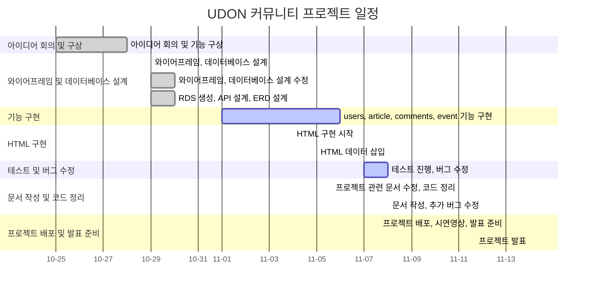

<br>
<br>

## 🏔️ 개발 환경

### Development
      

### Environment


### Communication


<br>
<br>

## 🍜 기능 정의서
➡️ [notion 에서 확인하기](https://oreumi.notion.site/5c13836699aa43c6a92a8f6c0b4b1abf?pvs=4)
### ⭐ 주요 기능
- 한 뚝배기 하실래요? - 로그인한 유저의 지역 맛집 리스트
- 동네 한바퀴 - 동네 이벤트 캘린더
- 가장 Hot 한 우동 - 좋아요 많은 우동

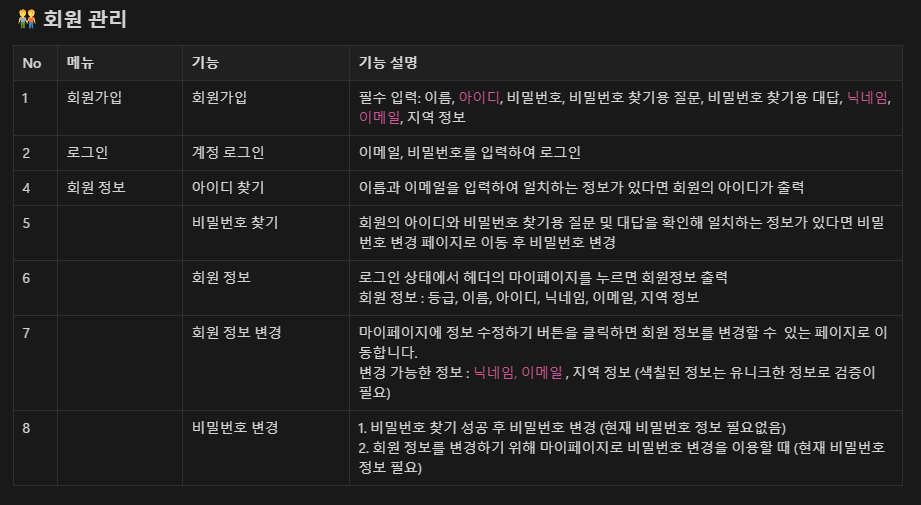
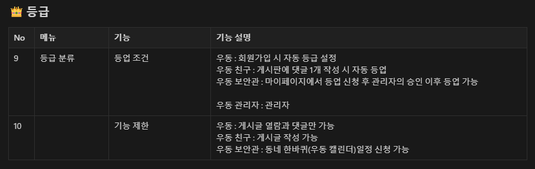
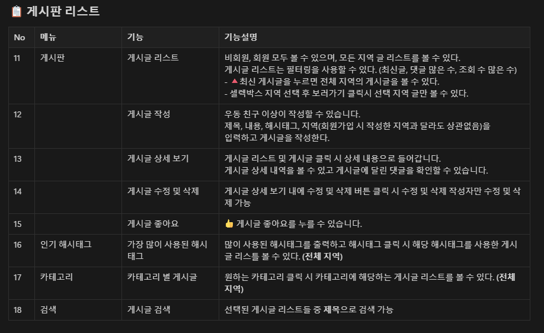

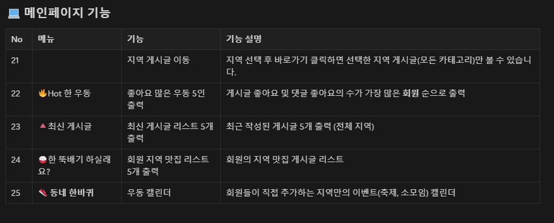
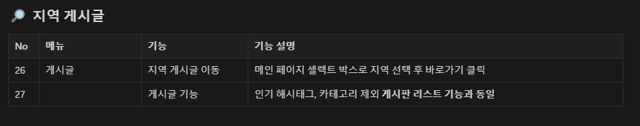
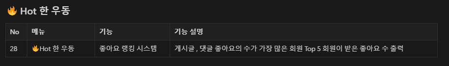
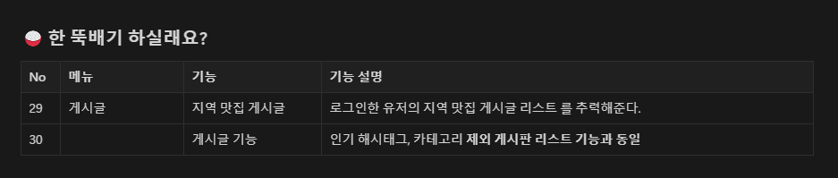
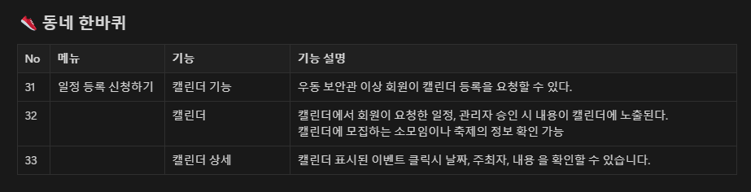
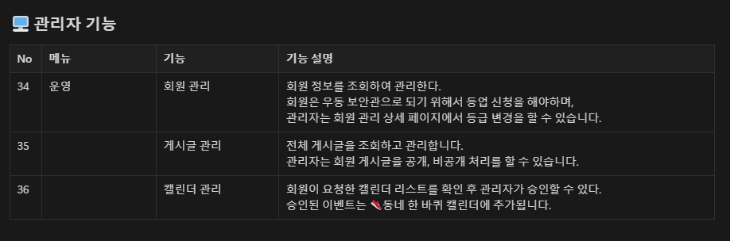

<br>
<br>


## 👀 화면 설계
➡️ [figma 에서 확인하기](https://www.figma.com/design/7KKhs0UJg8gFVFtwkWIFaV/%EC%9A%B0%EB%8F%99---%EC%99%80%EC%9D%B4%EC%96%B4%ED%94%84%EB%A0%88%EC%9E%84?node-id=0-1&t=DmdOUcsVNphem6eZ-1)

### ✅ 프론트
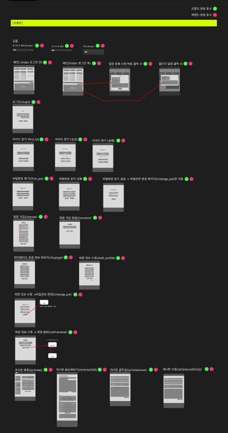

### ✅ 관리자
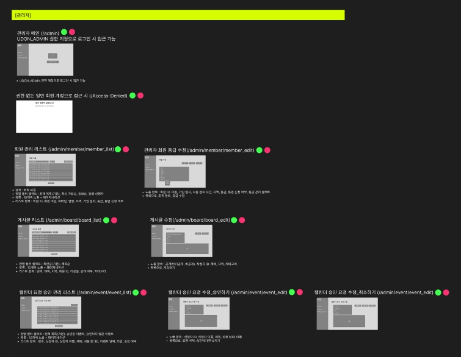

<br>
<br>

## 🛫 ERD(Entity Relationship Diagram)

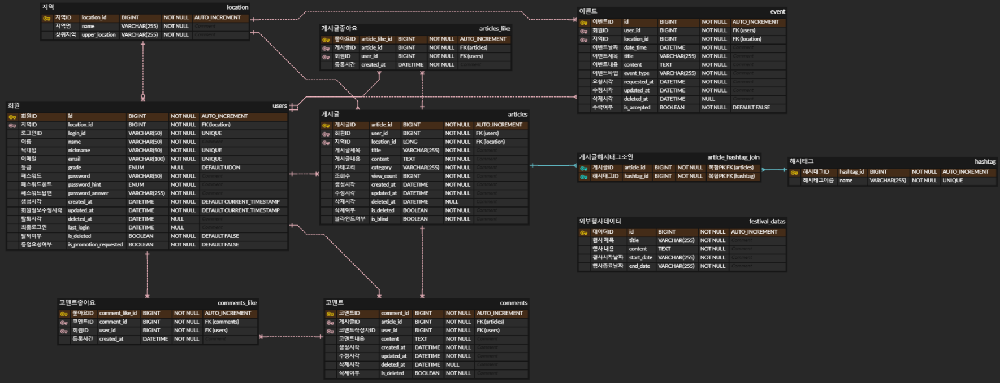

<br>
<br>

## 🚩 API 명세서
### ✅ REST API

| <span style = "color : pink; font-weight: bold;">유저</span> | API기능 | HTTP메소드 | URL | 응답 | 에러                                    |
|------------------------------------------------------------| --- | --- | --- | --- |---------------------------------------|
| 1                                                          | 회원가입 | POST | /api/register | 201 Created | 400 Bad Request, <br> 409 Conflict    |
| 2                                                          | 로그인 | POST | /api/login | 200 OK | 400 Bad Request,<br> 401 Unauthorized |
| 3                                                          | 유저리스트조회 | GET | /api/users | 200 OK | 400 Bad Request                       |
| 4                                                          | 유저정보조회(마이페이지) | GET | /api/users/{userId} | 200 OK | 400 Bad Request,<br> 404 Not Found    |
| 5                                                          | 회원정보수정 | PUT | /api/users/{userId} | 200 OK | 400 Bad Request,<br> 404 Not Found    |
| 6                                                          | 회원삭제 | DELETE | /api/users/{userId} | 204 NO Content | 400 Bad Request,<br> 404 Not Found    |
| 7                                                          | 아이디 찾기 | POST | /api/searchId | 200 OK | 400 Bad Request, <br> 404 Not Found   |
| 8                                                          | 비밀번호 찾기  | POST | /api/searchPassword | 200 OK | 400 Bad Request, <br> 404 Not Found   |
| 9                                                          | 아이디 중복체크 | POST | /api/checkId | 200 OK | 400 Bad Request                       |
| 10                                                         | 닉네임 중복체크 | POST | /api/checkNickname | 200 OK | 400 Bad Request                       |
| 11                                                         | 이메일 중복체크 | POST | /api/checkEmail | 200 OK | 400 Bad Request                       |
| 12                                                         | 회원 탈퇴(소프트딜리트) | POST | /api/withdrawal | 200 OK | 400 Bad Request                       |

| <span style = "color : pink; font-weight: bold;">게시글</span> | API기능               | HTTP메소드 | URL | 응답 | 에러                                  |
|-------------------------------------------------------------|---------------------| --- | --- | --- |-------------------------------------|
| 1                                                           | 게시글 추가              | POST | /api/articles | 201 Created | 400 Bad Request, <br> 404 Not Found |
| 2                                                           | 게시판 목록              | GET | /api/articles | 200 OK | 400 Bad Request                     |
| 3                                                           | 특정 게시글 조회           | GET | /api/articles/{Id} | 200 OK | 400 Bad Request,<br> 404 Not Found  |
| 4                                                           | 게시글 수정              | PUT | /api/articles/Id} | 200 OK | 400 Bad Request,<br> 404 Not Found  |
| 5                                                           | 게시글 삭제<br> (소프트딜리트) | DELETE | /api/articles/{Id} | 204 NO Content | 400 Bad Request,<br> 404 Not Found  |
| 6                                                           | 해시태그 게시글 조회         | GET | /api/articles/hashtag/{hashtagId} | 200 OK | 400 Bad Request                     |
| 7                                                           | 카테고리 게시글 조회         | GET | /api/articles/category/{category} | 200 OK | 400 Bad Request                     |
| 8                                                           | 한뚝배기 게시글 조회         | GET | /api/articles/hotRestaurant | 200 OK | 400 Bad Request                     |

| <span style = "color : pink; font-weight: bold;">댓글</span> | API기능               | HTTP메소드 | URL | 응답 | 에러                                  |
|------------------------------------------------------------|---------------------| --- | --- | --- |-------------------------------------|
| 1                                                          | 댓글 추가               | POST | /api/articles/{articleId}/comments | 201 Created | 400 Bad Request,<br> 404 Not Found  |
| 2                                                          | 댓글목록조회              | GET | /api/articles/{articleId}/comments | 200 OK | 400 Bad Request, <br> 404 Not Found |
| 3                                                          | 댓글조회(댓글만)           | GET | /api/articles/{articleId}/commentsonly | 200 OK | 400 Bad Request, 404 Not Found      |
| 4                                                          | 댓글 수정               | PUT | /api/articles/{articleId}/comments/{commentId} | 200 OK | 400 Bad Request, <br> 404 Not Found |
| 5                                                          | 댓글 삭제               | DELETE | /api/comments/{commentId} | 204 NO Content | 400 Bad Request,<br> 404 Not Found  |
| 6                                                          | 댓글 삭제 <br> (소프트딜리트) | DELETE | /api/articles/{articleId}/comments/{commentId} | 204 NO Content | 400 Bad Request, 404 Not Found |

| <span style = "color : pink; font-weight: bold;">좋아요</span> | API기능                | HTTP메소드 | URL | 응답 | 에러                                  |
|-------------------------------------------------------------|----------------------| --- | --- | --- |-------------------------------------|
| 1                                                           | 게시글 좋아요              | POST | /api/like/articlesLike | 201 Created | 400 Bad Request,<br> 404 Not Found  |
| 2                                                           | 게시글 좋아요 취소           | POST | /api/like/articlesLike | 200 OK | 400 Bad Request, <br> 404 Not Found |
| 3                                                           | 댓글 좋아요               | POST | /api/like/commentsLike | 201 Created | 400 Bad Request, <br> 404 Not Found |
| 4                                                           | 댓글 좋아요 <br> 취소       | PUT | /api/like/commentsLike | 200 OK | 400 Bad Request, <br> 404 Not Found |
| 5                                                           | 게시글 좋아요 순 조회         | GET | /api/like/articles | 200 OK | 400 Bad Request, 404 Not Found      |
| 6                                                           | 댓글 좋아요 순 조회          | GET | /api/like/comments | 200 OK | 400 Bad Request, 404 Not Found      |
| 7                                                           | 게시글 별로 댓글 좋아요 순 정렬조회 | GET | /api/like/comments/{articleId} | 200 OK | 400 Bad Request, 404 Not Found      |


| <span style = "color : pink; font-weight: bold;">행사</span> | API기능 | HTTP메소드 | URL | 응답 | 에러                                  |
|-------------------------------------------------------------|-------| --- | --- | --- |-------------------------------------|
| 1                                                           | 외부 행사 | GET | /api/event | 200 OK | 400 Bad Request,<br> 404 Not Found  |

| <span style = "color : pink; font-weight: bold;">이벤트</span> | API기능 | HTTP메소드 | URL | 응답 | 에러                                  |
|-------------------------------------------------------------| --- | --- | --- | --- |-------------------------------------|
| 1                                                           | 이벤트 메인 | GET | /api/event | 200 OK | 400 Bad Request,<br> 404 Not Found  |
| 2                                                           | 이벤트 추가 | POST | /api/event | 201 Created | 400 Bad Request, <br> 404 Not Found |
| 3                                                           | 이벤트 수정 | PUT | /api/event/{eventId} | 200 OK | 400 Bad Request, <br> 404 Not Found |
| 4                                                           | 이벤트 삭제 | DELETE | /api/event/{eventId} | 204 NO Content | 400 Bad Request,<br> 404 Not Found  |
| 5                                                           | 승인된 이벤트 조회 | GET | /api/event/accepted | 200 OK | 400 Bad Request, 404 Not Found      |
| 6                                                           | 승인되지 않은 이벤트 조회 | GET | /api/event/pending | 200 OK | 400 Bad Request, 404 Not Found      |

| <span style = "color : pink; font-weight: bold;">지역</span> | API기능 | HTTP메소드 | URL | 응답 | 에러 |
|------------------------------------------------------------| --- | --- | --- | --- | --- |
| 1                                                          | 지역 정보 조회 | GET | /getLowerLocations | 200 OK | 400 Bad Request, 404 Not Found |

| <span style = "color : pink; font-weight: bold;">관리자</span> | API기능 | HTTP메소드 | URL | 응답 | 에러                                    |
|-------------------------------------------------------------| --- | --- | --- | --- |---------------------------------------|
| 1                                                           | 관리자 로그인 | POST | /api/admin/login | 201 Created | 400 Bad Request,<br> 401 Unauthorized |
| 2                                                           | 관리자 회원 관리 리스트 | GET | /api/admin/users | 200 OK | 400 Bad Request, <br> 404 Not Found   |
| 3                                                           | 관리자 회원 등급 수정 | PUT | /api/admin/users/{userId} | 200 OK | 400 Bad Request, <br> 404 Not Found   |
| 4                                                           | 회원 이름 검색 | GET | /api/admin/member_list | 200 OK | 400 Bad Request, 404 Not Found        |
| 5                                                           | 관리자 게시글 상세  | GET | /api/admin/articles/{articleId} | 200 OK | 400 Bad Request,<br> 404 Not Found    |
| 6                                                           | 관리자 게시글 수정 | PUT | /api/admin/articles/{articleId} | 200 OK | 400 Bad Request, <br> 404 Not Found   |
| 7                                                           | 관리자 게시글 조회 | GET | /api/admin/articles | 200 OK | 400 Bad Request, 404 Not Found        |
| 8                                                           | 관리자 특정 게시글 조회 | GET | /api/admin/articles/{id} | 200 OK | 400 Bad Request, 404 Not Found        |
| 9                                                           | 게시글 공개/비공개 수정 | PUT | /api/admin/articles/{id}/toggle-visibility | 200 OK | 400 Bad Request, 404 Not Found        |
| 10                                                          | 모든 이벤트 목록 조회 | GET | /api/admin/event | 200 OK | 400 Bad Request, 404 Not Found        |
| 11                                                          | 이벤트 승인 | POST | /api/admin/event/{id}/approve | 200 OK | 400 Bad Request, 404 Not Found        |
| 12                                                          | 이벤트 승인 취소 | POST | /api/admin/event/{id}/cancel | 200 OK | 400 Bad Request, 404 Not Found        |
| 13                                                          | 특정 이벤트 조회 | GET | /api/admin/event/{id} | 200 OK | 400 Bad Request, 404 Not Found        |

### ✅ 랜더링 관련 API

| <span style = "color : pink; font-weight: bold;">메인</span> | API기능 | HTTP메소드 | URL | 응답 | 에러 |
|------------------------------------------------------------| --- | --- | --- | --- | --- |
| 1                                                          | 메인 화면 | GET | / | index.html | 400 Bad Request |

| <span style = "color : pink; font-weight: bold;">유저</span> | API기능 | HTTP메소드 | URL | 응답 | 에러                                |
|------------------------------------------------------------| --- | --- | --- | --- |-----------------------------------|
| 1                                                          | 로그인 | GET | /login | login.html | 400 Bad Request                   |
| 2                                                          | 아이디 찾기 | GET | /find_id | find_id.html | 400 Bad Request                   |
| 3                                                          | 아이디 찾기 처리 | POST | /find_id | find_id.html | 400 Bad Request                   |
| 4                                                          | 비밀번호 찾기 | GET | /find_pw | find_pw.html | 400 Bad Request                   |
| 5                                                          | 비밀번호 찾기 처리 | POST | /find_pw | find_pw.html | 400 Bad Request                   |
| 6                                                          | 비밀번호 변경 | GET | /change_pw | change_pw.html | 400 Bad Request                   |
| 7                                                          | 비밀번호 변경 처리 | POST | /change_pw | change_pw.html | change_pw.html로 리디렉션<br> (메시지 포함) |
| 8                                                          | 회원가입 | GET | /signup | signup.html | 400 Bad Request                   |
| 9                                                          | 회원가입 처리 | POST | /signup | signup.html | 400 Bad Request, 409 Conflict     |
| 10                                                         | 회원가입 완료 | GET | /success | success.html | 400 Bad Request                   |
| 11                                                         | 회원 탈퇴 | GET | /withdrawal | withdrawal.html | 400 Bad Request                   |
| 12                                                         | 마이페이지 | GET | /mypage | mypage.html | 400 Bad Request                   |
| 13                                                         | 등업 요청 | POST | /request-promotion | mypage.html | 400 Bad Request                   |
| 14                                                         | 개인정보 수정 | GET | /edit_profile | edit_profile.html | 400 Bad Request                   |
| 15                                                         | 게인정보 수정 처리 | POST | /edit_profile | mypage.html | 400 Bad Request                   |
| 16                                                         | 접근 제한 | GET | /access-denied | access-denied.html | 400 Bad Request                   |

| <span style = "color : pink; font-weight: bold;">게시판</span> | API기능 | HTTP메소드 | URL | 응답 | 에러 |
|-------------------------------------------------------------| --- | --- | --- | --- | --- |
| 1                                                           | 게시글 리스트 조회(전체or지역) | GET | /articles | board_list.html | 400 Bad Request |
| 2                                                           | 해시태그 게시글 리스트 조회 | GET | /articles/hashtag/{hashtagId} | board_list.html | 400 Bad Request |
| 3                                                           | 카테고리 게시글 리스트 조회 | GET | /articles/category/{category} | board_list.html | 400 Bad Request |
| 4                                                           | 한 뚝배기 게시글 리스트 조회 | GET | /articles/hotRestaurant | board_list.html | 400 Bad Request |
| 5                                                           | 게시글 생성 | GET | /articles/new | board_edit.html | 400 Bad Request |
| 6                                                           | 게시글 생성 처리 | POST | /articles/new | board_edit.html | 400 Bad Request |
| 7                                                           | 게시글 수정 | GET | /articles/edit/{articleId} | board_edit.html | 400 Bad Request, 404 Not Found |
| 8                                                           | 게시글 수정 처리 | POST | /articles/edit/{articleId} | board_edit.html | 400 Bad Request, 404 Not Found |
| 9                                                           | 게시글 상세 조회 | GET | /board_detail/{articleId} | board_detail.html | 400 Bad Request, 404 Not Found |

| <span style = "color : pink; font-weight: bold;">댓글</span> | API기능 | HTTP메소드 | URL | 응답 | 에러 |
|------------------------------------------------------------| --- | --- | --- | --- | --- |
| 1                                                          | 게시글/댓글 조회 | GET | /articles/{id} | board_detail.html | 존재하지 않을 경우 board_list.html로 리디렉션 |
| 2                                                          | 댓글 추가 | POST | /articles/{articlesId}/comments | board_detail.html로 리디렉션 | 존재하지 않을 경우 board_detail.html로 리디렉션 |

| <span style = "color : pink; font-weight: bold;">관리자</span> | API기능 | HTTP메소드 | URL | 응답 | 에러                                   |
|-------------------------------------------------------------| --- | --- | --- | --- |--------------------------------------|
| 1                                                           | 관리자 메인 | GET | /admin | admin_index.html | 400 Bad Request                      |
| 2                                                           | 회원 목록 | GET | /admin/member/member_list | member_list.html | 400 Bad Request                      |
| 3                                                           | 회원 정보 수정 | GET | /admin/member/member_edit/{id} | member_edit.html | 400 Bad Request, 404 Not Found       |
| 4                                                           | 회원 등급 수정 | POST | /admin/member/member_edit/{id} | member_list.html로 리디렉션 | 400 Bad Request, 404 Not Found       |
| 5                                                           | 게시글 목록 | GET | /admin/board/board_list | admin/board/board_list.html | 400 Bad Request                      |
| 6                                                           | 게시글 공개/비공개 | GET | /admin/board/board_edit/{id} | admin/board/board_list.html | 400 Bad Request, 404 Not Found       |
| 7                                                           | 게시글 공개/비공개 변경  | POST | /admin/board/toggle-visibility | admin/board/board_list.html로 리디렉션 | 400 Bad Request, 404 Not Found       |
| 8                                                           | 게시판 목록 반환 | GET | /admin/board/board | board_list.html | 400 Bad Request                      |
| 9                                                           | 이벤트 리스트 조회 | GET | /admin/event/event_list | event_list.html | error.html                           |
| 10                                                          | 이벤트 승인 여부 수정 | GET | /admin/event/event_edit/{id} | event_edit.html | error.html                           |
| 11                                                          | 이벤트 승인 처리 | POST | /admin/event/{id}/approve | event_edit.html로 리디렉션 | event_list.html로 리디렉션 <br> (에러메시지포함) |
| 12                                                          | 이벤트 승인 취소 | POST | /admin/event/{id}/cancel | event_edit.html로 리디렉션 | event_list.html로 리디렉션 <br> (에러메시지포함) |
| 13                                                          | 이벤트 요청 취소 | POST | /admin/event/{id} | event_list.html | event_list.html로 리디렉션 <br> (에러메시지포함) |

<br>
<br>

## 👾 프로젝트 구조
### 🚶‍♀️‍➡️Front-End

```
📁 src
 └── 📁 main
     ├── 📁 static
     │   ├── 📁 admin
     │   │   └── 📁 css
     │   ├── 📁 css
     │   ├── 📁 img
     │   └── 📁 js
     └── 📁 templates
         ├── 📁 admin
         │   ├── 📁 board
         │   ├── 📁 event
         │   ├── 📁 layout
         │   └── 📁 member
         ├── 📁 board
         ├── 📁 layout
         └── 📁 member

```

### 🚶‍♂️ Back-End

```
📁 src
├── 📃 EstsoftUdonCommunityApplication.java
├── 📁 config
│   └── 📃 SecurityConfig.java
├── 📁 controller
│   ├── 📃 ArticlesController.java
│   ├── 📃 BoardController.java
│   ├── 📃 CommentsController.java
│   ├── 📃 EventController.java
│   ├── 📃 LikeController.java
│   ├── 📃 LocationController.java
│   ├── 📃 MainController.java
│   ├── 📃 UsersController.java
│   ├── 📃 ViewBoardController.java
│   ├── 📃 ViewCommentController.java
│   ├── 📃 ViewController.java
│   └── 📁 admin
│       ├── 📃 AdminBoardController.java
│       ├── 📃 AdminBoardViewController.java
│       ├── 📃 AdminController.java
│       ├── 📃 AdminEventController.java
│       ├── 📃 AdminEventViewController.java
│       ├── 📃 AdminMemberController.java
│       └── 📃 AdminViewController.java
├── 📁 dto
│   ├── 📁 request
│   └── 📁 response
├── 📁 entity
├── 📁 enums
├── 📁 repository
├── 📁 security
├── 📁 service
│   └── 📁 admin
├── 📁 util

```

<br>
<br>

### 🖲️ 화면 설계 (시연 영상)

<table>
    <tbody>
        <tr>
            <td>메인화면(로그인 전)</td>
             <td>메인화면(로그인 후)</td>
        </tr>
        <tr>
            <td>
		        
            </td>
            <td>
                
            </td>
        </tr>
        <tr>
            <td>커뮤니티 게시판</td>
            <td>게시판 글 보기, 댓글</td>
        </tr>
        <tr>
            <td>
                
            </td>
            <td>
                
            </td>
        </tr>
        <tr>
            <td>회원 가입</td>
            <td>마이페이지</td>
        </tr>
        <tr>
            <td>
                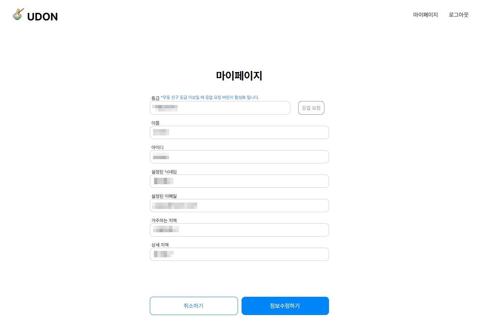
            </td>
            <td>
                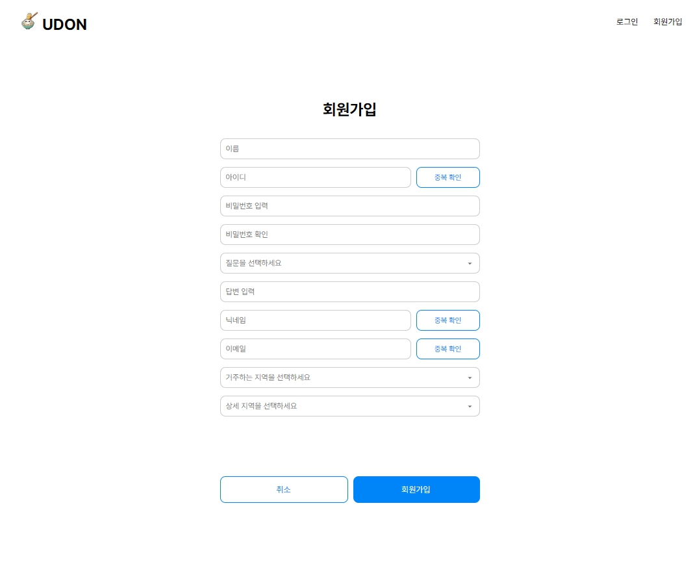
            </td>
        </tr>
    </tbody>
</table>

<br>
<br>

### 🌟 시연 영상

[](https://www.youtube.com/watch?v=_sJ3SVEHA3M&ab_channel=%EC%A7%95%EA%B2%85)

<br>
<br>

## 🧵 코딩 컨벤션
- Java Coding Convention

<br>
<br>


## 🫡 UDON 팀원 소개 및 역할 분담

|                       송주환                        |                       김진건                        |                       이상원                       |                       장금송                       |                        조아정                         |
|:------------------------------------------------:|:------------------------------------------------:|:-----------------------------------------------:|:-----------------------------------------------:|:--------------------------------------------------:|
|  |  | 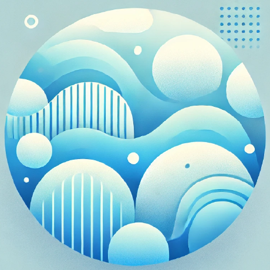 | 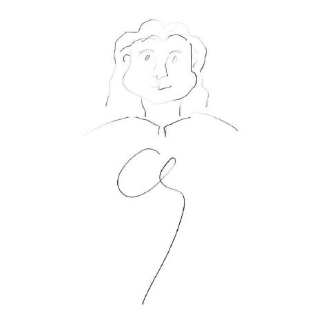 |  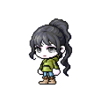   |
|                       👑팀장                       |                        팀원                        |                       팀원                        |                       팀원                        |                         팀원                         |
|      [GitHub](https://github.com/SongJwans)      |     [GitHub](https://github.com/jingun0516)      |    [GitHub](https://github.com/SangWon-Lee1)    |     [GitHub](https://github.com/goldsonge)      |      [GitHub](https://github.com/jeongggggg)       |
|        - 기능 구현<br/>- 버그 수정<br/>- 프로젝트 관리         |       - 기능 구현<br/>- 버그 수정<br/>- 외부 API 구현        |       - 기능 구현<br/>- 버그 수정<br/>- GitHub 관리       |       - 기능 구현<br/>- 버그 수정<br/>- 디자인 및 UI        | - 기능 구현<br/>- 버그 수정<br/>- 디자인 및 UI <br/>- 프로젝트 문서화 |

<br>
<br>

## 🤝 추가 구현 예정

- 메신저, 채팅, 알림
- 지역 인증, 회원가입 시 이메일 인증

<br>
<br>

## 🗨️ 프로젝트를 마치며...

- **송주환** : 처음 팀장 역할을 맡으면서 부족한 점이 많았지만, 믿고 응원해주셔서 감사합니다.
  저는 다 차려진 밥상에 숟가락만 🥄 ..
- **김진건** : 빼기는 커녕 더 하고 싶어하는 좋은 분들을 만나 재밌게 진행할 수 있어서 좋았습니다.
  이제 출시 준비하시죠
- **이상원** : 좋은 팀원분들을 만나 스트레스없이 재밌게 진행한 프로젝트였습니다. 일 중독자들..👍
- **장금송** : 너 나 할 것 없이 서로 도움을 주려고 하는 팀원들을 만나 정말 감사한 시간들이었습니다 :-)
- **조아정** : 열정적이고 함께 노력하는 좋은 팀원분들을 만나 많이 배우고 즐거운 프로젝트를 진행할 수 있었습니다.
  우동 최고 🍀